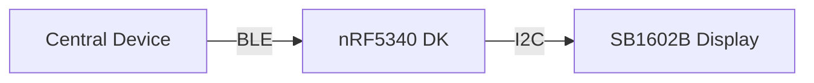

# BLE Display Controller

[](LICENSE)

## Overview

Bluetooth Low Energy (BLE) based display controller for SB1602B LCD, built with nRF Connect SDK. This project enables wireless text display control through BLE communication.

## Architecture



## Core Features

- BLE GATT Service for text transmission
- SB1602B LCD driver implementation
- Custom UUID definitions for BLE services
- I2C communication with display

## Project Structure

```
.
├── src/
│   ├── ble/
│   │   ├── cop.c          # BLE service implementation
│   │   └── cop_uuid.h     # BLE UUID definitions
│   └── drivers/
│       └── sb1602/        # LCD driver implementation
├── boards/                 # Board configuration
├── CMakeLists.txt         # Build system
└── prj.conf               # Project configuration
```

## Requirements

- nRF Connect SDK v2.5.0 or later
- nRF5340 Development Kit
- SB1602B LCD Display
- Visual Studio Code with nRF Connect Extension

## Building

```bash
west build -b nrf5340dk_nrf5340_cpuapp
```

## Flashing

```bash
west flash
```

## Testing

Run unit tests with:

```bash
west test
```

## Current Implementation

### BLE Service
- Custom service UUID: 0x1234
- Read/Write characteristic for display text
- Notification support for status updates

### Display Driver
- I2C communication at 400kHz
- 16x2 character display support
- Command and data mode handling

### Main Application
- BLE peripheral role
- Automatic advertising
- Display text update on BLE write

## Contributing

1. Fork the repository
2. Create feature branch
3. Commit changes
4. Push to branch
5. Create Pull Request

## License

Apache License 2.0 - See [LICENSE](LICENSE) for details.
