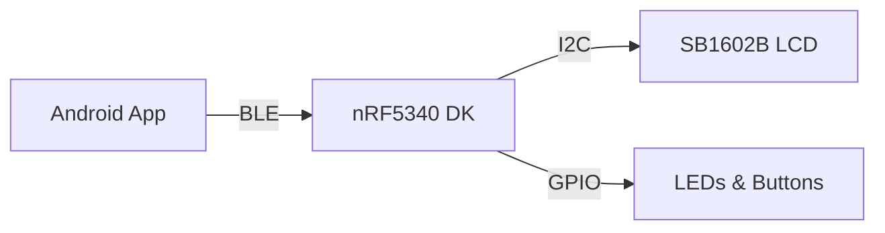

# ncs-recv-sb1602

[](LICENSE)

## Overview

A Nordic nRF Connect SDK project for receiving BLE data and displaying it on an SB1602 LCD display.

## Architecture



- Built on Nordic Connect SDK (NCS)
- Utilizes Bluetooth Low Energy (BLE) for data reception
- Implements I2C communication for LCD control
- Zephyr RTOS based application

## Core Features

- BLE peripheral role implementation
- SB1602 LCD display driver
- Real-time data reception and display
- Power-efficient operation

## Project Structure

```
ncs-recv-sb1602/
├── src/
│   ├── main.c
│   ├── lcd/
│   └── ble/
├── prj.conf
├── CMakeLists.txt
└── README.md
```

## Requirements

- Nordic Connect SDK v2.x or later
- nRF52 Series development kit
- SB1602 LCD display
- CMake 3.20.0 or later
- Python 3.6 or later

## Building

1. Set up Nordic Connect SDK environment
```bash
source ~/ncs/toolchain/env/setup.sh
```

2. Build the project
```bash
west build -b nrf52dk_nrf52832
```

## Flashing

Flash the built firmware using:
```bash
west flash
```

## BLE Services

### Display Service (Custom)
- UUID: `0000XXXX-0000-1000-8000-00805F9B34FB`
- Characteristics:
  - Display Text (Write)
    - UUID: `0000YYYY-0000-1000-8000-00805F9B34FB`
    - Properties: Write
    - Length: Up to 32 bytes

## License

This project is licensed under the MIT License - see the [LICENSE](LICENSE) file for details.
