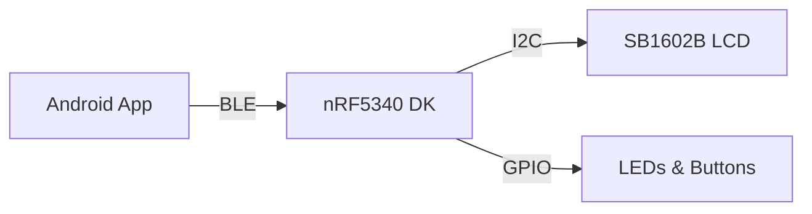

# BLE Display Controller

[](LICENSE)

## Overview

Bluetooth Low Energy (BLE) based display controller for SB1602B LCD, built with nRF Connect SDK. This project enables wireless text display control and LED control through BLE communication.

## Architecture



## Core Features

- Two BLE GATT Services:
  - LCD Print Service (LPS) for text display control
  - LED Button Service (LBS) for LED control and button state
- SB1602B LCD driver with I2C communication
- Android companion app for BLE control
- Button input with debouncing
- LED status indicators
- MCUboot support for DFU updates

## Project Structure

```
.
├── src/
│   ├── app/               # Main application logic
│   ├── ble/              # BLE services implementation
│   │   ├── lps/          # LCD Print Service
│   │   └── lbs/          # LED Button Service
│   └── drivers/          # Hardware drivers
│       ├── button/       # Button driver with debouncing
│       ├── led/          # LED control driver
│       └── sb1602/       # LCD driver implementation
├── central/
│   └── android/          # Android companion app
├── boards/               # Board configuration
├── sysbuild/            # MCUboot configuration
└── CMakeLists.txt       # Build system
```

## Requirements

- nRF Connect SDK v2.8.0 or later
- nRF5340 Development Kit
- SB1602B LCD Display
- Android Studio for companion app
- Visual Studio Code with nRF Connect Extension

## Building

For nRF5340 firmware:
```bash
west build -b nrf5340dk_nrf5340_cpuapp
```

For Android app:
```bash
cd central/android
./gradlew assembleDebug
```

## Flashing

```bash
west flash
```

## BLE Services

### LCD Print Service (LPS)
- Service UUID: a00c1710-74ff-4bd5-9e86-cf601d80c054
- Print characteristic: a00c1711-74ff-4bd5-9e86-cf601d80c054
- Clear characteristic: a00c1712-74ff-4bd5-9e86-cf601d80c054

### LED Button Service (LBS)
- Service UUID: 00001523-1212-efde-1523-785feabcd123
- Button characteristic: 00001524-1212-efde-1523-785feabcd123
- LED characteristic: 00001525-1212-efde-1523-785feabcd123

## License

Apache License 2.0 - See [LICENSE](LICENSE) for details.
