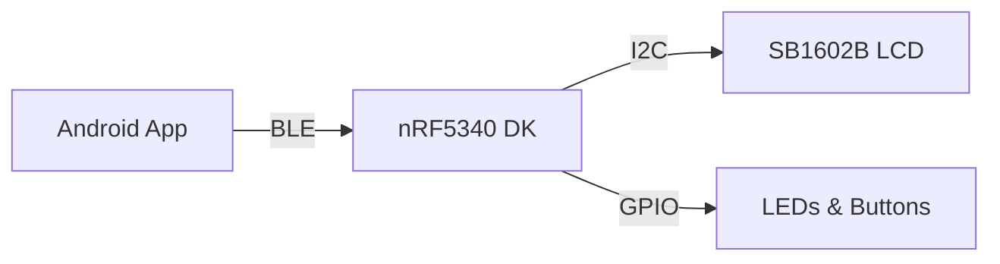

# NCS Receiver for SB1602

[](LICENSE)

## Overview
Nordic Semiconductor nRF53シリーズを使用したBLEレシーバープロジェクト。SB1602 LCD displayとの通信を実装。

## Architecture



- nRF5340 DK (nRF5340)をメインボードとして使用
- BLE通信による外部デバイスからのデータ受信
- SB1602 LCDディスプレイへのデータ表示

## Core Features

- BLE Central mode operation
- GATT Client implementation
- SB1602 LCD制御
- System state management
- Power optimization

## Project Structure

```
ncs-recv-sb1602/
├── CMakeLists.txt
├── prj.conf
├── src/
│   ├── main.c
│   ├── ble_central.c
│   ├── ble_central.h
│   ├── lcd_control.c
│   └── lcd_control.h
├── boards/
└── README.md
```

## Requirements

- Nordic Connect SDK (NCS) v2.8
- nRF5340 DK
- Development environment setup for nRF Connect SDK
- SB1602 LCD Display

## Building

1. Set up Nordic Connect SDK environment
```bash
source ~/ncs/toolchain/env/setup.sh
```

2. Build the project
```bash
west build -b nrf52dk_nrf52832
```

## Flashing

Flash the built firmware using:
```bash
west flash
```

## BLE Services

### Device Information Service (0x180A)
- Manufacturer Name (0x2A29): 製造者名
- Model Number (0x2A24): モデル番号
- Serial Number (0x2A25): シリアル番号

### Custom Service (0xXXXX)
- Data Characteristic (0xYYYY): 表示データ
  - Properties: Read, Notify
  - Length: 20 bytes
- Control Characteristic (0xZZZZ): 制御コマンド
  - Properties: Write
  - Length: 1 byte
- Status Characteristic (0xWWWW): 状態通知
  - Properties: Read, Notify
  - Length: 1 byte

## License

This project is licensed under the MIT License - see the [LICENSE](LICENSE) file for details.
