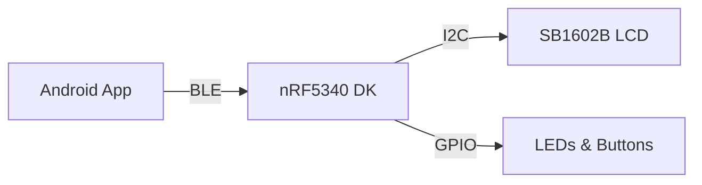

# NCS BLE Receiver Project

[](LICENSE)

## Overview
A Nordic Connect SDK (NCS) based BLE receiver project using the nRF53 series. This project implements Local Positioning System (LPS) services and custom drivers.

## Architecture
The project is built using the sysbuild system, which manages multiple images and their configurations. It implements a BLE peripheral role with LPS services.



## Core Features
- BLE peripheral implementation
- Local Positioning System (LPS) service support
- Custom driver integration
- Sysbuild-based project structure

## Project Structure
```
ncs-recv-sb1602/
├── app/
├── boards/
├── cmake/
├── drivers/
├── include/
├── src/
└── sysbuild/
```

## Requirements
- Nordic Connect SDK v2.8
- nRF53 Series Development Kit
- Build System: Sysbuild

## BLE Services
### LPS Service
UUID Characteristics:
- Position Data: `XXXXXXXX-XXXX-XXXX-XXXX-XXXXXXXXXXXX`
  - Provides positioning data in 3D space
- Configuration: `XXXXXXXX-XXXX-XXXX-XXXX-XXXXXXXXXXXX`
  - Handles service configuration
- Status: `XXXXXXXX-XXXX-XXXX-XXXX-XXXXXXXXXXXX`
  - Reports service status and errors

## Driver APIs
### SB1602 Driver
```c
// Initialize the driver
int sb1602_init(const struct device *dev);

// Read sensor data
int sb1602_read_data(const struct device *dev, struct sb1602_data *data);

// Configure sensor
int sb1602_configure(const struct device *dev, struct sb1602_config *cfg);
```

For detailed implementation examples and usage, refer to the driver documentation in the `drivers/` directory.

## License

This project is licensed under the MIT License - see the [LICENSE](LICENSE) file for details.
